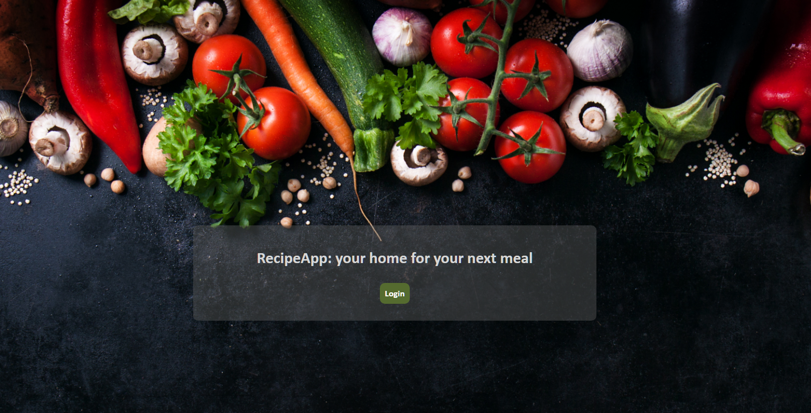
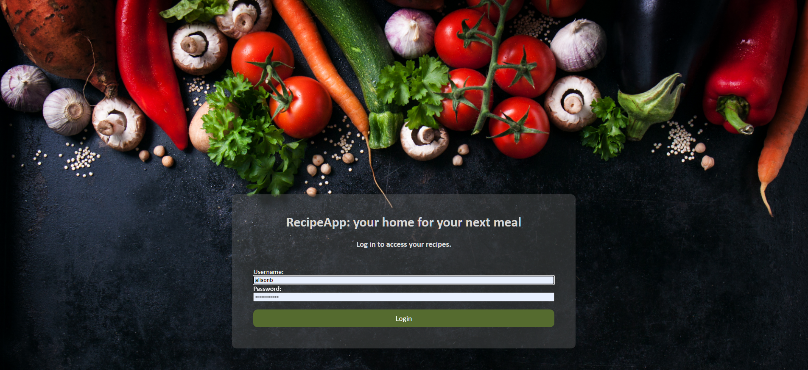
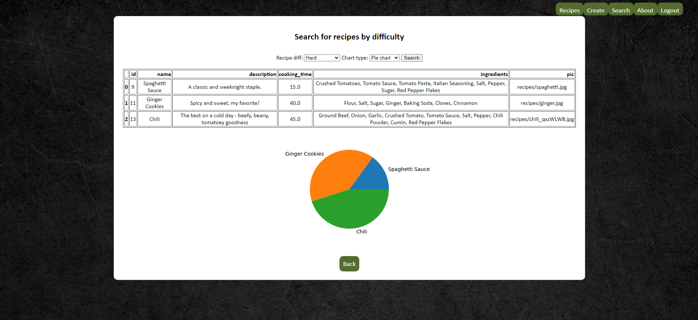
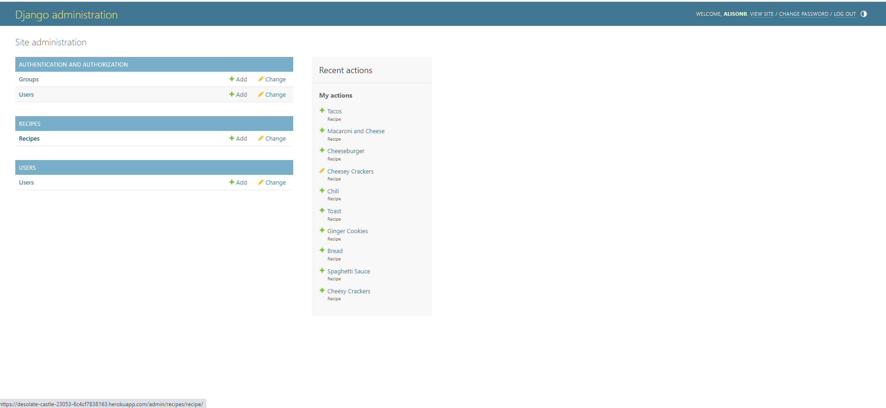

# Recipe App

A Python web app built using Django as a framework. Admin can use the dashboard to perform CRUD operations on the database. Users can sign up and create their own content. Users are able to create recipes as well as search for recipes by their difficulty.

## Created With
Django
Python
MySQL

## Installation:
Clone the repository.
Create a virtual environment and activate it.
Install the dependencies.
Run the migrations.
Start the server.

## Usage:
To create a new recipe, go to the "Create" page.
To search for recipes, go to the "Search Recipes" page and choose the chart type you prefer.
To manage the database, log in to the admin dashboard.

### RecipeApp in action

